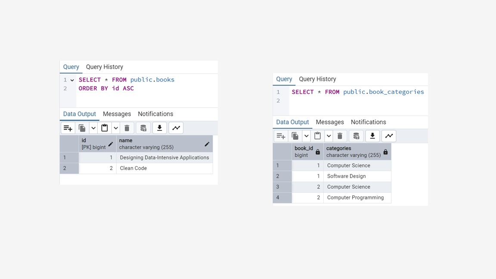

# @ElementCollection - List

```java
@Entity
@Table(name="books")
public class Book {

    @Id
    @GeneratedValue(strategy = GenerationType.IDENTITY)
    private long id;

    private String name;

    @ElementCollection
    private List<String> categories;

    public Book(){}

    public Book(String name, List<String> categories) {
        this.name = name;
        this.categories = categories;
    }

    public long getId() {
        return id;
    }

    public void setId(long id) {
        this.id = id;
    }

    public String getName() {
        return name;
    }

    public void setName(String name) {
        this.name = name;
    }

    public List<String> getCategories() {
        return categories;
    }

    public void setCategories(List<String> categories) {
        this.categories = categories;
    }

    @Override
    public String toString() {
        return "Book{" +
                "id=" + id +
                ", name='" + name + '\'' +
                ", categories=" + categories +
                '}';
    }
}
```



## Using LEFT JOIN FETCH to fetch attributes of a Product in one single query

```java
            // Fetch all books along with categories
            TypedQuery<Book> query = em.createQuery(
                    "SELECT DISTINCT b FROM Book b LEFT JOIN FETCH b.categories",
                    Book.class
            );

            List<Book> books = query.getResultList();

            System.out.println("Number of books: " + books.size());
            books.forEach(book ->
                    System.out.println("Book: " + book.getName() + ", Categories: " + book.getCategories()));
```

