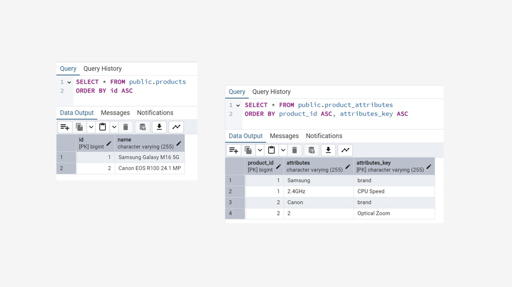

# @ElementCollection - Map

```java
@Entity
@Table(name="products")
public class Product {

    @Id
    @GeneratedValue(strategy = GenerationType.IDENTITY)
    private long id;

    private String name;

    @ElementCollection
    private Map<String,String> attributes;

    public Product(){}

    public Product(String name, Map<String,String> attributes) {
        this.name = name;
        this.attributes = attributes;
    }

    public long getId() {
        return id;
    }

    public void setId(long id) {
        this.id = id;
    }

    public String getName() {
        return name;
    }

    public void setName(String name) {
        this.name = name;
    }

    public Map<String, String> getAttributes() {
        return attributes;
    }

    public void setAttributes(Map<String, String> attributes) {
        this.attributes = attributes;
    }

    @Override
    public String toString() {
        return "Product{" +
                "id=" + id +
                ", name='" + name + '\'' +
                ", attributes=" + attributes +
                '}';
    }
}
```




## Using LEFT JOIN FETCH to fetch attributes of a Product in one single query

```java
            TypedQuery<Product> query = em.createQuery(
                    "SELECT DISTINCT e FROM Product e LEFT JOIN FETCH e.attributes",
                    Product.class
            );

            List<Product> products = query.getResultList();

            System.out.println("Number of books: " + products.size());
            products.forEach(product ->
                    System.out.println("Product: " + product));
```
